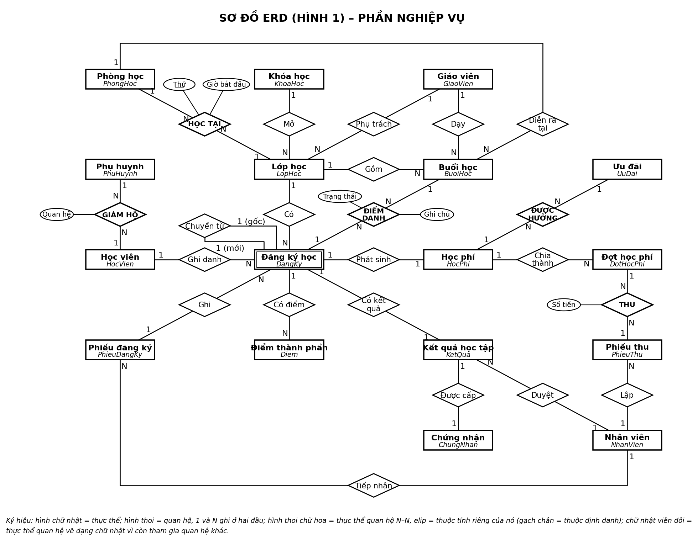
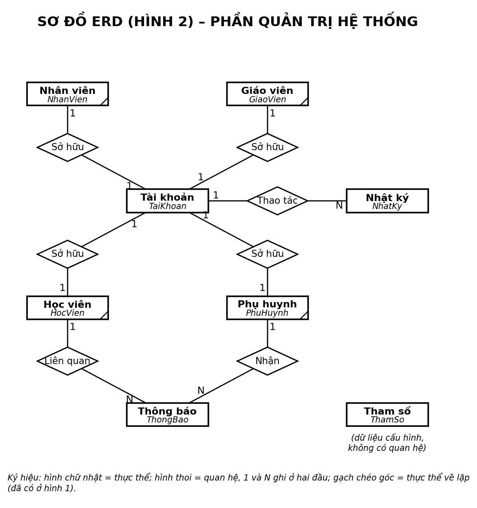

# 3.2 Quan hệ giữa các thực thể và sơ đồ ERD – Hệ thống quản lý trung tâm ngoại ngữ

Thuộc giai đoạn Thiết kế hệ thống (KE_HOACH.md, mục 3.2). Làm tiếp bước 2 và bước 3 trong quy trình dựng ERD của bài giảng (mục 5.3.1):
1. Xác định thực thể và thuộc tính, lập bảng: đã làm ở `thiet_ke/01_thuc_the.md`.
2. **Xác định quan hệ giữa các thực thể**: mối quan hệ, bậc quan hệ, kiểu quan hệ (mục 2 dưới đây).
3. **Vẽ sơ đồ Quan hệ – Thực thể** (mục 3).

Nguồn đầu vào: 26 thực thể ở `thiet_ke/01_thuc_the.md` mục 8, và 34 thuộc tính quan hệ ở mục 9 của cùng tài liệu.

Sơ đồ ERD sinh từ `so_do/src/erd.py`. Script này đọc **bảng quan hệ ở mục 2 của chính tài liệu này** cùng mục 8, mục 9 của 01_thuc_the.md, kiểm tra các quy tắc ở mục 4, rồi mới vẽ. Muốn sửa quan hệ thì sửa bảng ở mục 2, sau đó chạy lại `python so_do/src/erd.py`.

---

## 1. Cơ sở lý thuyết (bài giảng mục 5.2.2)

**Bậc quan hệ** là số thực thể tham gia quan hệ:
- **Bậc 1**: quan hệ giữa các cá thể trong cùng một thực thể.
- **Bậc 2**: quan hệ giữa hai thực thể. Đây là loại thường gặp.
- **Bậc 3 trở lên**: luôn đưa được về bậc 2 bằng cách thêm một thực thể trung gian.

**Kiểu quan hệ**: 1–1, 1–N, N–N. Với N–N, "nhiều" được hiểu là 0, 1 hoặc nhiều cá thể.

**Ký pháp**:
- Thực thể vẽ bằng hình chữ nhật.
- Quan hệ vẽ bằng hình thoi, bên trong ghi tên quan hệ là một **động từ** ("Có", "Thi", "Học"). Số **1** và **N** ghi ở hai đầu đường nối.
- Thực thể quan hệ (Hình 4.45, quan hệ "THI") vẽ bằng hình thoi tên viết hoa. Các thuộc tính riêng vẽ bằng hình elip nối vào hình thoi; thuộc tính định danh được gạch chân.

**Cách mô tả quan hệ khi thiết kế tệp** (bài giảng mục 5.2.2.3):

| Kiểu | Cách mô tả |
|---|---|
| 1–1 | Đưa định danh của thực thể này vào thực thể kia, làm thuộc tính quan hệ |
| 1–N | Đưa định danh của **thực thể đầu 1** vào **thực thể đầu nhiều**, làm thuộc tính quan hệ |
| N–N | Lập **thực thể quan hệ** có khóa gồm định danh của 2 thực thể gốc. Thực thể này thường có thêm thuộc tính riêng, đôi khi không có |
| Bậc 1, kiểu 1–1 hoặc 1–N | Thêm một thuộc tính quan hệ tự trỏ về chính thực thể đó |

---

## 2. Bước 2 – Bảng quan hệ giữa các thực thể

Quy ước của bảng:
- Với kiểu 1–N, **thực thể A là đầu 1** và thực thể B là đầu N. Thuộc tính quan hệ nằm ở B.
- Với kiểu N–N, cột *Thực thể quan hệ* ghi tên tệp đã lập ở 3.1. Tên quan hệ viết hoa, giống "THI" trong bài giảng.
- Cột *Thuộc tính quan hệ* ghi số dòng ở mục 9 của 01_thuc_the.md.

| Mã | Tên quan hệ | Thực thể A | Thực thể B | Bậc | Kiểu | Thuộc tính quan hệ | Thực thể quan hệ | Phát biểu nghiệp vụ |
|---|---|---|---|---|---|---|---|---|
| Q01 | GIÁM HỘ | Học viên (HocVien) | Phụ huynh (PhuHuynh) | 2 | N-N | 1, 2 | HocVienPhuHuynh | Một phụ huynh giám hộ một hoặc nhiều học viên (anh chị em cùng học). Một học viên có thể có nhiều người giám hộ (bố, mẹ); học viên đủ 18 tuổi có thể không có ai. Thuộc tính riêng: Quan hệ. |
| Q02 | Mở | Khóa học (KhoaHoc) | Lớp học (LopHoc) | 2 | 1-N | 3 | – | Một khóa học được mở thành nhiều lớp, có thể chưa mở lớp nào. Mỗi lớp thuộc đúng một khóa học. |
| Q03 | Phụ trách | Giáo viên (GiaoVien) | Lớp học (LopHoc) | 2 | 1-N | 4 | – | Một giáo viên phụ trách nhiều lớp. Mỗi lớp có đúng một giáo viên phụ trách. |
| Q04 | HỌC TẠI | Lớp học (LopHoc) | Phòng học (PhongHoc) | 2 | N-N | 5, 6 | LichTuan | Một lớp học tại một hoặc nhiều phòng, tùy theo thứ trong tuần. Một phòng được nhiều lớp dùng ở các khung giờ khác nhau. Thuộc tính riêng: Thứ (thuộc định danh), Giờ bắt đầu. |
| Q05 | Gồm | Lớp học (LopHoc) | Buổi học (BuoiHoc) | 2 | 1-N | 7 | – | Một lớp gồm nhiều buổi học. Mỗi buổi học thuộc đúng một lớp. |
| Q06 | Diễn ra tại | Phòng học (PhongHoc) | Buổi học (BuoiHoc) | 2 | 1-N | 8 | – | Một phòng là nơi diễn ra nhiều buổi học. Mỗi buổi học diễn ra tại đúng một phòng. |
| Q07 | Dạy | Giáo viên (GiaoVien) | Buổi học (BuoiHoc) | 2 | 1-N | 9 | – | Một giáo viên dạy nhiều buổi học, kể cả các buổi dạy thay. Mỗi buổi học do đúng một giáo viên dạy. |
| Q08 | Tiếp nhận | Nhân viên (NhanVien) | Phiếu đăng ký (PhieuDangKy) | 2 | 1-N | 10 | – | Một nhân viên tuyển sinh tiếp nhận nhiều phiếu đăng ký. Mỗi phiếu do đúng một nhân viên tiếp nhận. |
| Q09 | Ghi danh | Học viên (HocVien) | Đăng ký học (DangKy) | 2 | 1-N | 11 | – | Một học viên có nhiều đăng ký (nhiều lớp, nhiều khóa). Mỗi đăng ký là của đúng một học viên. |
| Q10 | Có | Lớp học (LopHoc) | Đăng ký học (DangKy) | 2 | 1-N | 12 | – | Một lớp có nhiều đăng ký; số đăng ký giữ chỗ không vượt sĩ số tối đa. Mỗi đăng ký ở đúng một lớp. |
| Q11 | Ghi | Phiếu đăng ký (PhieuDangKy) | Đăng ký học (DangKy) | 2 | 1-N | 13 | – | Một phiếu đăng ký ghi một hoặc nhiều đăng ký. Mỗi đăng ký được ghi trên đúng một phiếu. |
| Q12 | Chuyển từ | Đăng ký học (DangKy) | Đăng ký học (DangKy) | 1 | 1-1 | 14 | – | Một đăng ký có thể sinh ra từ tối đa một đăng ký gốc, khi chuyển lớp hoặc học lại sau bảo lưu. Một đăng ký gốc sinh ra tối đa một đăng ký mới, vì sau đó nó đã ở trạng thái Chuyển lớp hoặc Bảo lưu. |
| Q13 | Phát sinh | Đăng ký học (DangKy) | Học phí (HocPhi) | 2 | 1-1 | 15 | – | Mỗi đăng ký phát sinh tối đa một khoản học phí; đăng ký có đăng ký gốc thì không phát sinh. Mỗi khoản học phí thuộc đúng một đăng ký. |
| Q14 | Chia thành | Học phí (HocPhi) | Đợt học phí (DotHocPhi) | 2 | 1-N | 16 | – | Một khoản học phí chia thành 1 hoặc 2 đợt (QT05). Mỗi đợt thuộc đúng một khoản. |
| Q15 | ĐƯỢC HƯỞNG | Học phí (HocPhi) | Ưu đãi (UuDai) | 2 | N-N | 17, 18 | ApDungUuDai | Một khoản học phí được hưởng không, một hoặc nhiều ưu đãi cộng dồn (QT04). Một ưu đãi áp cho nhiều khoản. Không có thuộc tính riêng, giống ví dụ "Giảng viên – Môn học" của bài giảng. |
| Q16 | THU | Phiếu thu (PhieuThu) | Đợt học phí (DotHocPhi) | 2 | N-N | 20, 21 | ChiTietPhieuThu | Một phiếu thu thu cho một hoặc nhiều đợt, có thể của nhiều đăng ký và nhiều học viên. Một đợt có thể được nộp qua nhiều phiếu (nộp thiếu rồi nộp tiếp). Thuộc tính riêng: Số tiền. |
| Q17 | Lập | Nhân viên (NhanVien) | Phiếu thu (PhieuThu) | 2 | 1-N | 19 | – | Một nhân viên kế toán lập nhiều phiếu thu. Mỗi phiếu do đúng một nhân viên lập. |
| Q18 | ĐIỂM DANH | Đăng ký học (DangKy) | Buổi học (BuoiHoc) | 2 | N-N | 22, 23 | DiemDanh | Một đăng ký được điểm danh ở nhiều buổi học. Một buổi học điểm danh nhiều đăng ký. Hai bên dùng chung Mã lớp, nên chỉ điểm danh được buổi học của chính lớp đó. Thuộc tính riêng: Trạng thái, Ghi chú. |
| Q19 | Có điểm | Đăng ký học (DangKy) | Điểm thành phần (Diem) | 2 | 1-N | 24 | – | Một đăng ký có tối đa 2 điểm thành phần (giữa kỳ, cuối kỳ). Mỗi điểm thuộc đúng một đăng ký. |
| Q20 | Có kết quả | Đăng ký học (DangKy) | Kết quả học tập (KetQua) | 2 | 1-1 | 25 | – | Mỗi đăng ký có tối đa một kết quả; chỉ có khi lớp đã kết thúc và đăng ký không ở trạng thái Chuyển lớp, Bảo lưu, Nghỉ học. Mỗi kết quả thuộc đúng một đăng ký. |
| Q21 | Duyệt | Nhân viên (NhanVien) | Kết quả học tập (KetQua) | 2 | 1-N | 26 | – | Một QL đào tạo duyệt nhiều kết quả. Mỗi kết quả do tối đa một người duyệt; chưa duyệt thì để rỗng. |
| Q22 | Được cấp | Kết quả học tập (KetQua) | Chứng nhận (ChungNhan) | 2 | 1-1 | 27 | – | Mỗi kết quả Đạt được cấp đúng một chứng nhận; kết quả Không đạt thì không có. Mỗi chứng nhận cấp cho đúng một kết quả. |
| Q23 | Sở hữu | Nhân viên (NhanVien) | Tài khoản (TaiKhoan) | 2 | 1-1 | 28 | – | Mỗi nhân viên có tối đa một tài khoản. Tài khoản vai trò nhân viên thuộc đúng một nhân viên. |
| Q24 | Sở hữu | Giáo viên (GiaoVien) | Tài khoản (TaiKhoan) | 2 | 1-1 | 29 | – | Mỗi giáo viên có tối đa một tài khoản. Tài khoản vai trò Giáo viên thuộc đúng một giáo viên. |
| Q25 | Sở hữu | Học viên (HocVien) | Tài khoản (TaiKhoan) | 2 | 1-1 | 30 | – | Mỗi học viên có tối đa một tài khoản. Tài khoản vai trò Học viên thuộc đúng một học viên. |
| Q26 | Sở hữu | Phụ huynh (PhuHuynh) | Tài khoản (TaiKhoan) | 2 | 1-1 | 31 | – | Mỗi phụ huynh có tối đa một tài khoản. Tài khoản vai trò Phụ huynh thuộc đúng một phụ huynh. |
| Q27 | Liên quan | Học viên (HocVien) | Thông báo (ThongBao) | 2 | 1-N | 32 | – | Một học viên được nhắc tới trong nhiều thông báo. Mỗi thông báo nói về đúng một học viên. |
| Q28 | Nhận | Phụ huynh (PhuHuynh) | Thông báo (ThongBao) | 2 | 1-N | 33 | – | Một phụ huynh nhận nhiều thông báo về con mình. Mỗi thông báo gửi tới tối đa một phụ huynh; để rỗng nghĩa là gửi cho chính học viên. |
| Q29 | Thao tác | Tài khoản (TaiKhoan) | Nhật ký (NhatKy) | 2 | 1-N | 34 | – | Một tài khoản có nhiều dòng nhật ký. Mỗi dòng do đúng một tài khoản thực hiện. |

### 2.1 Thống kê

| Tiêu chí | Số quan hệ | Gồm |
|---|---|---|
| Bậc 1 | 1 | Q12 |
| Bậc 2 | 28 | Các quan hệ còn lại |
| Bậc 3 trở lên | 0 | Điểm danh vốn là bậc 3, đã đưa về bậc 2 (mục 2.2) |
| Kiểu 1–N | 16 | Q02, Q03, Q05–Q11, Q14, Q17, Q19, Q21, Q27–Q29 |
| Kiểu 1–1 | 8 | Q12, Q13, Q20, Q22, Q23–Q26 |
| Kiểu N–N | 5 | Q01, Q04, Q15, Q16, Q18. Thêm quan hệ N–N "Học" giữa Học viên và Lớp học, biểu diễn qua Đăng ký học (mục 2.2) |
| **Tổng** | **29** | Dùng đủ 34 thuộc tính quan hệ của 3.1 (5 quan hệ N–N, mỗi quan hệ 2 thuộc tính; 24 quan hệ còn lại, mỗi quan hệ 1 thuộc tính) |

### 2.2 Giải thích các trường hợp đặc biệt

- **Học viên – Lớp học là quan hệ N–N "Học"**, giống *Sinh viên – Môn học* trong bài giảng. Thực thể quan hệ của nó là **Đăng ký học** (DangKy), khóa (MaHV, MaLop). Đăng ký học còn tham gia 6 quan hệ khác (Q11, Q12, Q13, Q18, Q19, Q20). Một hình thoi không nối tiếp được với hình thoi khác, nên trên ERD, Đăng ký học được vẽ bằng **hình chữ nhật có hình thoi lồng bên trong** (chú giải trên sơ đồ). Nó nối với Học viên và Lớp học bằng hai quan hệ 1–N là Q09 và Q10.
- **Điểm danh là quan hệ bậc 3 Học viên – Lớp học – Buổi học đã đưa về bậc 2**, đúng cách bài giảng hướng dẫn với quan hệ bậc cao. Nhờ Đăng ký học (gói Học viên và Lớp) và Buổi học (gói Lớp và Số buổi), Điểm danh chỉ còn nối 2 thực thể. Phần Mã lớp chung bảo đảm học viên được điểm danh đúng buổi của lớp mình.
- **Các vòng trên ERD không thừa.** Có 3 chỗ hai thực thể được nối theo hai đường:

  | Đường thứ nhất | Đường thứ hai | Vì sao không bỏ được |
  |---|---|---|
  | Giáo viên –Phụ trách→ Lớp học | Giáo viên –Dạy→ Buổi học | Giáo viên phụ trách lớp chỉ là mặc định. Người dạy thực tế từng buổi có thể khác (dạy thay). Báo cáo giảng dạy 5.4 đếm theo người dạy thực tế. |
  | Lớp học –HỌC TẠI→ Phòng học | Phòng học –Diễn ra tại→ Buổi học | Lịch tuần là mẫu để sinh buổi học. Phòng của từng buổi có thể đổi (học bù, phòng bảo trì). Kiểm tra trùng phòng (QT07) dựa trên buổi học. |
  | Học phí –Chia thành→ Đợt học phí | Phiếu thu –THU→ Đợt học phí | Hai quan hệ khác nghĩa: đợt là số tiền *phải* nộp, còn THU là số tiền *đã* nộp. |

- **Tham số** (ThamSo) **không có quan hệ nào.** Đây là dữ liệu cấu hình. Bài giảng (mục 5.3.1) ghi rõ khi đối chiếu DFD và ERD thì *bỏ qua dữ liệu thuộc về cấu hình của hệ thống*. ThamSo vẫn có mặt trên ERD hình 2 để đủ 26 thực thể, nhưng đứng riêng.

---

## 3. Bước 3 – Sơ đồ Quan hệ – Thực thể (ERD)

ERD có 26 thực thể và 29 quan hệ, nên được vẽ thành **2 hình** cho dễ đọc. Gộp 2 hình lại là ERD của toàn hệ thống.
- **Hình 1 – Phần nghiệp vụ** (kho D1–D4 và Nhân viên): 17 thực thể, quan hệ Q01–Q22.
- **Hình 2 – Phần quản trị hệ thống** (kho D5): Tài khoản, Thông báo, Nhật ký, Tham số, cùng 4 thực thể đã có ở hình 1. Hình này gồm các quan hệ Q23–Q29.

Thực thể đã có ở hình 1 khi vẽ lại ở hình 2 được đánh dấu bằng **gạch chéo góc dưới phải**, cùng quy ước "vẽ lặp" với DFD.

Các thuộc tính đầy đủ của từng thực thể không vẽ lên ERD, giống ví dụ ERD các trường đại học trong bài giảng (Hình 4.46). Chúng nằm ở bảng thực thể của 3.1. Riêng thuộc tính của các thực thể quan hệ N–N được vẽ bằng hình elip, theo Hình 4.45. Các thuộc tính chung với hai thực thể gốc (Mã HV, Mã lớp…) không vẽ lặp lại.

---

## 4. Kiểm tra (chạy tự động trong `so_do/src/erd.py`)

Kết quả khi chạy `python so_do/src/erd.py`: **đạt**. Script kiểm tra các nội dung sau:

| # | Nội dung kiểm tra | Kết quả |
|---|---|---|
| 1 | Mỗi thuộc tính quan hệ ở 3.1 mục 9 thuộc đúng một quan hệ trong bảng mục 2 | Đạt: 34/34, không thiếu, không trùng |
| 2 | Kiểu 1–N: thuộc tính quan hệ nằm ở thực thể đầu N và trỏ về định danh của đầu 1 (bài giảng 5.2.2.3) | Đạt: 16/16 |
| 3 | Kiểu 1–1: định danh của một bên nằm ở bên kia | Đạt: 8/8 |
| 4 | Kiểu N–N: có thực thể quan hệ loại *Quan hệ*, khóa gồm định danh của 2 thực thể gốc | Đạt: 5/5. Có một ngoại lệ có lý do: khóa của LichTuan là (MaLop, Thu), không chứa MaPhong, vì mỗi thứ một lớp chỉ học một phòng (giả định G2 ở 3.1). Cách làm này giống ví dụ "Lần thi" của bài giảng: thêm một thuộc tính riêng vào khóa |
| 5 | Mỗi thuộc tính quan hệ trỏ tới **đủ** các thành phần khóa của thực thể đích | Đạt |
| 6 | Bậc 1 khi và chỉ khi hai đầu là cùng một thực thể; không có quan hệ bậc ≥ 3 | Đạt |
| 7 | Mọi thực thể đều tham gia ít nhất một quan hệ | Đạt, trừ ThamSo (dữ liệu cấu hình, mục 2.2) |
| 8 | Hai hình ERD vẽ đủ 26 thực thể và 29 quan hệ; mỗi quan hệ vẽ đúng một lần, và cả hai thực thể của nó có mặt trên cùng hình | Đạt |

### 4.1 Mỗi kho trên DFD ứng với các thực thể trên ERD

Bài giảng (mục 5.3.1) đặt 2 ràng buộc giữa DFD và ERD. Kết quả kiểm tra hai ràng buộc này:

**(1) Dữ liệu từ mọi luồng cập nhật kho phải đủ để diễn tả các thuộc tính trên ERD.** Mỗi thực thể đều có một xử lý ghi, đúng như ma trận thực thể – chức năng (3.1 mục 6.3):

| Kho | Thực thể | Luồng cập nhật trên DFD mức 1 |
|---|---|---|
| D1 | HocVien, PhuHuynh, HocVienPhuHuynh | 1.1 → D1 "Hồ sơ học viên" |
| D1 | GiaoVien / KhoaHoc / PhongHoc | 1.2 / 1.3 / 1.4 → D1 |
| D2 | LopHoc, LichTuan | 2.1 → D2 "Lớp học" (lịch tuần là một phần của kế hoạch mở lớp) |
| D2 | BuoiHoc | 2.3 → D2 "Lịch học (buổi học)" |
| D2 | PhieuDangKy, DangKy | 2.2 → D2 "Đăng ký"; 2.4 → D2 "Đăng ký cập nhật" |
| D3 | UuDai, HocPhi, DotHocPhi, ApDungUuDai | 3.1 → D3 "Ưu đãi, học phí phải thu" |
| D3 | PhieuThu, ChiTietPhieuThu | 3.2 → D3 "Phiếu thu mới" |
| D4 | DiemDanh / Diem / KetQua / ChungNhan | 4.1 / 4.2 / 4.3 / 4.4 → D4 |
| D5 | NhanVien, TaiKhoan | 5.1 → D5 "Tài khoản, nhật ký" |
| D5 | ThongBao | 5.2 → D5 "Thông báo đã gửi" |
| D5 | NhatKy, ThamSo | 5.1 → D5. Đây là dữ liệu hệ thống: các xử lý khác cũng ghi nhật ký và đọc tham số, nhưng không vẽ thành luồng, theo lưu ý về dữ liệu cấu hình của bài giảng |

**(2) Dữ liệu lấy ra từ các kho phải nằm trên ERD.** Bảng dưới đây chỉ ra đường đi trên ERD cho từng luồng đọc kho và từng báo cáo của DFD. Ký hiệu `A –Q→ B` nghĩa là đi từ A sang B qua quan hệ Q.

| Xử lý | Luồng đọc / báo cáo | Đường đi trên ERD |
|---|---|---|
| 1.1 | Hồ sơ hiện có (kiểm tra trùng) | HocVien (DienThoai, NgaySinh) |
| 2.1 | Sĩ số đăng ký | LopHoc –Q10→ DangKy (đếm theo TrangThai) |
| 2.2 | Sĩ số lớp, đăng ký trùng | LopHoc –Q10→ DangKy; khóa (MaHV, MaLop) chặn đăng ký trùng |
| 2.2, 2.4 | Tình trạng đóng học phí | DangKy –Q13→ HocPhi –Q14→ DotHocPhi –Q16→ PhieuThu (cộng Số tiền); với đăng ký mới thì đi thêm DangKy –Q12→ đăng ký gốc |
| 2.3 | Lịch đã xếp (kiểm tra trùng) | BuoiHoc theo Ngay, nối GiaoVien qua Q07 và PhongHoc qua Q06 |
| 2.3 | Sinh buổi học | LopHoc –Q04→ LichTuan; LopHoc –Q02→ KhoaHoc (SoBuoi, ThoiLuongBuoi) |
| 2.4 | Số buổi đã học | LopHoc –Q05→ BuoiHoc (TrangThai = Đã dạy) |
| 3.1 | Học phí khóa học | DangKy –Q10→ LopHoc –Q02→ KhoaHoc (HocPhi) |
| 3.1 | Học viên cũ (QT01) | HocVien –Q09→ DangKy –Q10→ LopHoc (TrangThai = Kết thúc) |
| 3.3 | Công nợ, quá hạn | DangKy –Q13→ HocPhi –Q14→ DotHocPhi (SoTien, HanDong), trừ tổng Q16 |
| 3.4 | Doanh thu theo khóa, theo hình thức | PhieuThu –Q16→ DotHocPhi –Q14→ HocPhi –Q13→ DangKy –Q10→ LopHoc –Q02→ KhoaHoc; PhieuThu.HinhThuc |
| 4.1 | Danh sách lớp, buổi học | LopHoc –Q10→ DangKy –Q09→ HocVien; LopHoc –Q05→ BuoiHoc |
| 4.3 | Trọng số, chuyên cần, điểm | DangKy –Q10→ LopHoc –Q02→ KhoaHoc (TS); DangKy –Q18→ BuoiHoc (DiemDanh); DangKy –Q19→ Diem |
| 4.4 | Danh sách học viên đạt | KetQua (KetQua = Đạt) –Q22→ ChungNhan |
| 5.1 | Phụ huynh chỉ xem con mình | TaiKhoan –Q26→ PhuHuynh –Q01→ HocVien |
| 5.2 | Liên hệ học viên, phụ huynh | HocVien –Q01→ PhuHuynh; ghi ThongBao qua Q27, Q28 |
| 5.2 | Lịch học thay đổi | BuoiHoc –Q05→ LopHoc –Q10→ DangKy –Q09→ HocVien |
| 5.3 | Báo cáo tuyển sinh (học viên mới) | HocVien –Q09→ DangKy –Q11→ PhieuDangKy (NgayDK của đăng ký đầu tiên), nhóm theo KhoaHoc qua Q10, Q02 |
| 5.3 | Báo cáo lớp học (lấp đầy, mở, hủy) | LopHoc –Q10→ DangKy; LopHoc.SiSoToiDa, TrangThai |
| 5.4 | Chuyên cần, kết quả theo lớp | LopHoc –Q10→ DangKy –Q18→ DiemDanh; DangKy –Q20→ KetQua |
| 5.4 | Số buổi đã dạy của giáo viên | GiaoVien –Q07→ BuoiHoc (TrangThai = Đã dạy) |

Kết luận: mọi luồng đọc kho và mọi báo cáo đều có đường đi trên ERD. Không cần thêm thực thể hay quan hệ nào.

---

## 5. Đầu ra cho các bước sau

| Bước | Dùng gì từ tài liệu này |
|---|---|
| 3.3 Chuẩn hóa | Kết quả 3NF của 3 chứng từ phải trùng các thực thể và quan hệ ở đây: Phiếu đăng ký → Q09–Q11, Q13–Q15; Phiếu thu → Q16, Q17; Bảng điểm → Q18–Q20 |
| 3.4 CSDL vật lý | Mỗi thuộc tính quan hệ thành FOREIGN KEY. Với 1–1, thêm UNIQUE ở phía chứa khóa ngoại: ChungNhan (MaHV, MaLop); TaiKhoan MaNV, MaGV, MaHV, MaPH (UNIQUE khi khác rỗng). Q12 là khóa ngoại tự trỏ (MaHV, MaLopGoc) → DangKy |
| 3.5, 3.6 | Đường đi ở mục 4.1 là các truy vấn chính cho form và báo cáo |
