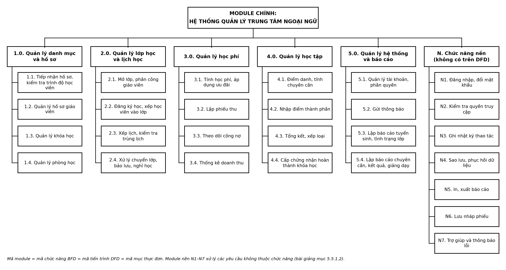

# 3.5 Thiết kế phần mềm – Hệ thống quản lý trung tâm ngoại ngữ

Thuộc giai đoạn Thiết kế hệ thống (KE_HOACH.md, mục 3.5). Bài giảng mục 5.5 chia việc thiết kế phần mềm thành **6 bước**:
1. xác định mục đích, yêu cầu;
2. thiết kế giải thuật;
3. chọn ngôn ngữ lập trình;
4. viết chương trình;
5. thử nghiệm;
6. biên soạn tài liệu hướng dẫn.

Tài liệu này làm bước 1–3 đầy đủ, và lập kế hoạch cho bước 4–6 (bước 4–6 thực hiện ở GĐ4).

Phương án **tự xây dựng** đã được chọn ở GĐ1 (`phan_tich/01_ke_hoach.md` mục 2.3). Lý do: phần mềm có sẵn chỉ đáp ứng khoảng 65–70% yêu cầu, dưới ngưỡng 80% mà bài giảng (mục 5.5.2) đặt ra để chấp nhận mua.

Sơ đồ module được sinh từ `so_do/src/module.py`. Script đọc các bảng ở **mục 3, 4, 5 của tài liệu này** và đối chiếu với BFD (`bfd.py`), DFD mức 1 (`dfd.py`) và kho – thực thể của 3.1. Kết quả kiểm tra ở mục 6.

---

## 1. Bước 1 – Mục đích và yêu cầu của phần mềm

**Mục đích:** một phần mềm web dùng chung cho cả trung tâm. Phần mềm thay cho các file Excel rời, sổ giấy và Zalo, và tự động hóa đúng 20 chức năng lá của BFD theo quy tắc QT01–QT16.

| Nhóm | Yêu cầu | Nguồn |
|---|---|---|
| Chức năng | 20 chức năng lá của BFD_v3. Mỗi chức năng là một module | 2.2, BFD |
| Dữ liệu | Dùng CSDL `TrungTamNgoaiNgu` đã thiết kế (26 bảng, các view báo cáo) | 3.4 |
| Truy cập | Chạy trên trình duyệt máy tính và điện thoại; giáo viên điểm danh bằng điện thoại | 2.1 mục 9.2 |
| Hiệu năng | 50–100 người dùng đồng thời vào giờ cao điểm | BT1, 2.1 |
| Bảo mật | Phân quyền theo vai trò **và theo phạm vi dữ liệu**: phụ huynh chỉ xem được thông tin của con mình, giáo viên chỉ xem được lớp mình dạy | 2.1, GĐ1 mục 3.4 (pháp lý) |
| Tiện dụng | Lưu nháp phiếu đăng ký và phiếu thu; in chứng từ; xuất Excel, PDF | 2.1 (quan sát), BT1 |
| An toàn dữ liệu | Sao lưu hằng ngày; ghi nhật ký mọi thao tác | 2.1, 3.1 E25 |

---

## 2. Bước 2 – Thiết kế giải thuật: phương pháp Top-down

Bài giảng nêu 2 phương pháp. Nhóm chọn **Top-down (từ đỉnh xuống)**. Phương pháp Bottom-up dùng để gộp các chương trình đã có sẵn ở từng bộ phận thành một hệ thống, như ví dụ Program 1–8 của bài giảng. Trung tâm hiện **chưa có chương trình nào**, chỉ có file Excel (2.1 mục 2.2), nên không có gì để gộp từ dưới lên.

Cách phân rã đi theo đúng nguyên tắc "một nguồn sự thật" của KE_HOACH: **mã chức năng BFD = mã tiến trình DFD = mã module = mã mục trên thực đơn (3.6)**.
- **Mức 0:** module chính "Hệ thống quản lý trung tâm ngoại ngữ".
- **Mức 1:** 5 phân hệ ứng với 1.0–5.0, cộng với phân hệ **N – Chức năng nền**. Phân hệ N gồm các module không có trên DFD, vì chúng xử lý "các vấn đề không thuộc chức năng" như phân quyền, sửa lỗi… (bài giảng mục 5.5.1.2).
- **Mức 2:** 20 module ứng với 20 tiến trình x.y của DFD mức 1, cộng với 7 module nền N1–N7.
- **Mức 3:** các chức năng con trong từng module (cột cuối của bảng mục 3), giống Hình 4.47 của bài giảng (cập nhật – tìm kiếm – báo cáo).

Số module: 1 + 6 + 27 = **34 module**, nhiều hơn 25 tiến trình trên DFD (5 tiến trình mức 0 cộng 20 tiến trình mức 1). Đúng như bài giảng nói: "số module bao giờ cũng nhiều hơn số process trên DFD".



---

## 3. Danh sách module

| Mã | Tên module | Phân hệ | Ứng với | Chức năng con (mức 3) |
|---|---|---|---|---|
| 1.1 | Tiếp nhận hồ sơ, kiểm tra trình độ học viên | 1.0 | DFD 1.1 | Tìm và kiểm tra trùng hồ sơ (điện thoại + ngày sinh); thêm, sửa hồ sơ học viên; thêm phụ huynh và quan hệ giám hộ; ghi kết quả kiểm tra đầu vào; ngừng hồ sơ |
| 1.2 | Quản lý hồ sơ giáo viên | 1.0 | DFD 1.2 | Thêm, sửa hồ sơ giáo viên (kiểm tra trùng điện thoại, email); cập nhật tình trạng làm việc; tra cứu |
| 1.3 | Quản lý khóa học | 1.0 | DFD 1.3 | Thêm, sửa khóa học; đặt học phí, số buổi, trọng số (tổng 100%); ngừng khóa |
| 1.4 | Quản lý phòng học | 1.0 | DFD 1.4 | Thêm, sửa phòng; cập nhật tình trạng (sẵn sàng, bảo trì) |
| 2.1 | Mở lớp, phân công giáo viên | 2.0 | DFD 2.1 | Lập lớp, phân công giáo viên đúng ngôn ngữ; lập lịch tuần, chọn phòng; theo dõi sĩ số; đến ngày khai giảng thì chuyển sang Đang học hoặc Hủy (QT06) |
| 2.2 | Đăng ký học, xếp học viên vào lớp | 2.0 | DFD 2.2 | Lập phiếu đăng ký (lưu nháp được); kiểm tra lớp còn chỗ, đăng ký trùng; xem hiệu lực đăng ký (QT05); in kết quả đăng ký, danh sách lớp |
| 2.3 | Xếp lịch, kiểm tra trùng lịch | 2.0 | DFD 2.3 | Sinh các buổi học từ lịch tuần; kiểm tra trùng giáo viên, trùng phòng (QT07); đổi lịch, xếp học bù, dạy thay; in lịch học, lịch dạy |
| 2.4 | Xử lý chuyển lớp, bảo lưu, nghỉ học | 2.0 | DFD 2.4 | Lập đơn; xét theo cây quyết định (QT08–QT10); cập nhật đăng ký và tạo đăng ký mới có đăng ký gốc; tự chuyển sang Nghỉ học khi quá hạn bảo lưu |
| 3.1 | Tính học phí, áp dụng ưu đãi | 3.0 | DFD 3.1 | Quản lý danh mục ưu đãi; xét ưu đãi theo bảng quyết định 3.1 (QT01–QT04); chia đợt và đặt hạn (QT05) |
| 3.2 | Lập phiếu thu | 3.0 | DFD 3.2 | Lập phiếu thu theo từng đợt (lưu nháp được); kiểm tra số tiền (không vượt số còn nợ, đợt 1 ≥ 50%); in phiếu thu 2 liên |
| 3.3 | Theo dõi công nợ | 3.0 | DFD 3.3 | Tính công nợ tại một ngày; lọc khoản quá hạn (QT16); bỏ đăng ký nghỉ học (QT10) |
| 3.4 | Thống kê doanh thu | 3.0 | DFD 3.4 | Doanh thu theo kỳ, theo khóa học, theo hình thức thanh toán; so sánh với kỳ trước; kèm tổng công nợ |
| 4.1 | Điểm danh, tính chuyên cần | 4.0 | DFD 4.1 | Điểm danh theo buổi trên điện thoại; sửa trong 24 giờ; tính tỷ lệ chuyên cần, đánh dấu cảnh báo (QT11, QT12) |
| 4.2 | Nhập điểm thành phần | 4.0 | DFD 4.2 | Nhập điểm giữa kỳ, cuối kỳ và nhận xét; khóa điểm sau khi lớp đã tổng kết |
| 4.3 | Tổng kết, xếp loại | 4.0 | DFD 4.3 | Tính điểm tổng kết, xếp loại, xét đạt (bảng quyết định 4.3); QL đào tạo duyệt và chốt kết quả; in bảng điểm |
| 4.4 | Cấp chứng nhận hoàn thành khóa học | 4.0 | DFD 4.4 | Cấp số chứng nhận cho học viên đạt (QT15); in chứng nhận |
| 5.1 | Quản lý tài khoản, phân quyền | 5.0 | DFD 5.1 | Tạo, khóa tài khoản và gán vai trò; cấu hình tham số (bảng ThamSo); xem nhật ký |
| 5.2 | Gửi thông báo | 5.0 | DFD 5.2 | Mỗi ngày tự sinh thông báo về lịch học thay đổi, học phí sắp hoặc đã quá hạn, cảnh báo vắng, kết quả; gửi cho học viên, và cả phụ huynh nếu học viên dưới 18 tuổi |
| 5.3 | Lập báo cáo tuyển sinh, tình trạng lớp | 5.0 | DFD 5.3 | Báo cáo học viên mới theo tháng, theo khóa; sĩ số, tỷ lệ lấp đầy, số lớp mở và hủy |
| 5.4 | Lập báo cáo chuyên cần, kết quả, giảng dạy | 5.0 | DFD 5.4 | Chuyên cần theo lớp, danh sách học viên nghỉ nhiều; tỷ lệ đạt, phân bố xếp loại; số buổi đã dạy của từng giáo viên |
| N1 | Đăng nhập, đổi mật khẩu | N | Không có trên DFD (bảo mật) | Đăng nhập, đăng xuất; đổi mật khẩu; khóa tạm khi nhập sai nhiều lần |
| N2 | Kiểm tra quyền truy cập | N | Không có trên DFD (bảo mật) | Kiểm tra vai trò trước mỗi thao tác (ma trận mục 5); lọc dữ liệu theo phạm vi: của mình, của con mình, lớp mình |
| N3 | Ghi nhật ký thao tác | N | Không có trên DFD (dữ liệu hệ thống, 3.2 mục 4.1) | Mọi module gọi N3 để ghi thao tác Thêm, Sửa, Ngừng, Duyệt, In vào bảng NhatKy |
| N4 | Sao lưu, phục hồi dữ liệu | N | Không có trên DFD (an toàn dữ liệu) | Sao lưu tự động hằng ngày; phục hồi từ bản sao lưu |
| N5 | In, xuất báo cáo | N | Không có trên DFD (dùng chung) | In chứng từ; xuất Excel, PDF cho mọi báo cáo |
| N6 | Lưu nháp phiếu | N | Không có trên DFD (2.1, kết quả quan sát) | Lưu tạm phiếu đăng ký, phiếu thu đang nhập trên trình duyệt; mở lại để làm tiếp |
| N7 | Trợ giúp và thông báo lỗi | N | Không có trên DFD (3.6) | Đổi tên ràng buộc CSDL bị vi phạm (vd `CK_Diem_Diem`) thành câu báo lỗi kèm gợi ý sửa; hướng dẫn trên từng màn hình |

---

## 4. Module và dữ liệu

Cột *Ghi* và *Đọc* liệt kê các bảng CSDL (3.4) mà module thêm, sửa hoặc đọc khi xử lý. Script đối chiếu hai cột này với các luồng kho trên DFD mức 1:
- bảng được **ghi** phải thuộc kho mà tiến trình x.y có luồng ghi;
- bảng được **đọc** phải thuộc kho mà x.y có luồng đọc, hoặc kho mà chính x.y ghi vào.

Kho của từng bảng lấy theo 3.1 mục 6.3.

Cột *Tra cứu danh mục* là các bảng chỉ dùng để **hiển thị thuộc tính mô tả qua khóa ngoại**, ví dụ in họ tên học viên, tên khóa lên phiếu thu, hoặc nhóm doanh thu theo khóa. DFD không vẽ các lần tra cứu này thành luồng riêng (DFD "không diễn tả hết chi tiết", bài giảng mục 3.3.3). Vì vậy cột này không đối chiếu với DFD.

Có 3 bảng dùng chung, không ghi lặp ở từng module:
- `ThamSo`: mọi module đọc qua hàm `fn_ThamSo`;
- `NhatKy`: mọi module ghi qua N3;
- `NhanVien`: lấy mã nhân viên từ phiên đăng nhập (N1).

Đây là các quy ước đã nêu ở 3.1 (E26) và 03_chuc_nang mục 4.

| Mã | Ghi | Đọc | Tra cứu danh mục | View, hàm dùng |
|---|---|---|---|---|
| 1.1 | HocVien, PhuHuynh, HocVienPhuHuynh | HocVien, PhuHuynh, HocVienPhuHuynh | – | – |
| 1.2 | GiaoVien | GiaoVien | – | – |
| 1.3 | KhoaHoc | KhoaHoc | – | – |
| 1.4 | PhongHoc | PhongHoc | – | – |
| 2.1 | LopHoc, LichTuan | KhoaHoc, GiaoVien, PhongHoc, LopHoc, LichTuan, DangKy | – | v_SiSoLop |
| 2.2 | PhieuDangKy, DangKy | HocVien, KhoaHoc, LopHoc, LichTuan, DangKy, HocPhi, DotHocPhi, ChiTietPhieuThu | – | v_SiSoLop, v_HocPhiDangKy |
| 2.3 | BuoiHoc | KhoaHoc, GiaoVien, PhongHoc, LopHoc, LichTuan, BuoiHoc, DangKy | HocVien | – |
| 2.4 | DangKy | LopHoc, BuoiHoc, DangKy, HocPhi, DotHocPhi, ChiTietPhieuThu | HocVien | v_ChuoiDangKy, v_HocPhiDangKy |
| 3.1 | UuDai, HocPhi, DotHocPhi, ApDungUuDai | KhoaHoc, LopHoc, LichTuan, BuoiHoc, PhieuDangKy, DangKy, UuDai | – | v_HocVienCu |
| 3.2 | PhieuThu, ChiTietPhieuThu | HocPhi, DotHocPhi, ChiTietPhieuThu | HocVien, LopHoc, KhoaHoc | – |
| 3.3 | – | DangKy, HocPhi, DotHocPhi, ChiTietPhieuThu | HocVien | fn_CongNo |
| 3.4 | – | PhieuThu, ChiTietPhieuThu, DotHocPhi | LopHoc, KhoaHoc | v_DoanhThu, fn_CongNo |
| 4.1 | DiemDanh | DangKy, BuoiHoc, DiemDanh | HocVien | v_ChuyenCan |
| 4.2 | Diem | DangKy, Diem | HocVien | – |
| 4.3 | KetQua | KhoaHoc, DiemDanh, Diem, KetQua | HocVien, LopHoc | v_KetQuaTinh, v_ChuyenCan |
| 4.4 | ChungNhan | KetQua, ChungNhan | HocVien, LopHoc, KhoaHoc, BuoiHoc | – |
| 5.1 | TaiKhoan, NhanVien, ThamSo | HocVien, PhuHuynh, GiaoVien, TaiKhoan, NhanVien, NhatKy, ThamSo | – | – |
| 5.2 | ThongBao | HocVien, PhuHuynh, HocVienPhuHuynh, LopHoc, DangKy, BuoiHoc, HocPhi, DotHocPhi, ChiTietPhieuThu, DiemDanh, KetQua | – | fn_CongNo, v_ChuyenCan |
| 5.3 | – | HocVien, KhoaHoc, LopHoc, DangKy, PhieuDangKy | – | v_SiSoLop, v_TuyenSinh |
| 5.4 | – | GiaoVien, KhoaHoc, LopHoc, BuoiHoc, DangKy, DiemDanh, KetQua | – | v_ChuyenCan, v_GiangDay, v_KetQuaTinh |
| N1 | TaiKhoan | TaiKhoan, NhanVien | – | – |
| N2 | – | TaiKhoan, HocVienPhuHuynh, LopHoc, BuoiHoc | – | – |
| N3 | NhatKy | – | – | – |
| N4 | – | – | – | Sao lưu toàn bộ CSDL (BACKUP DATABASE) |
| N5 | – | – | – | Dùng dữ liệu của module gọi nó |
| N6 | – | – | – | Lưu ở bộ nhớ trình duyệt, không cần bảng |
| N7 | – | – | – | Đọc tên ràng buộc trong thông báo lỗi của SQL Server |

### 4.1 Liên kết giữa các module

| Module gọi / kích hoạt | Module được gọi | Nội dung | Ứng với |
|---|---|---|---|
| 2.1 | 2.3 | Lớp đủ sĩ số và được mở thì sinh buổi học | Luồng nội bộ "Lớp đã mở" (DFD-2.0) |
| 2.2 | 3.1 | Có đăng ký mới (không có đăng ký gốc) thì lập khoản học phí | 04_dac_ta mục 1.8, chức năng 3.1 |
| 3.3 | 3.4 | Tổng công nợ đưa vào báo cáo doanh thu | Luồng nội bộ "Tổng công nợ" (DFD-3.0) |
| 4.3 | 4.4 | Danh sách học viên đạt | Luồng nội bộ "Danh sách học viên đạt" (DFD-4.0) |
| 2.3, 3.3, 4.1, 4.3 | 5.2 | Lịch thay đổi, khoản quá hạn, cảnh báo vắng, kết quả đã duyệt thì sinh thông báo | 5.2 đọc D2, D3, D4 |
| Mọi module | N2, N3, N7 | Kiểm tra quyền trước khi chạy; ghi nhật ký sau khi ghi dữ liệu; đổi lỗi thành câu báo lỗi | – |
| Mọi module có báo cáo hoặc chứng từ | N5 | In, xuất Excel/PDF | – |
| 2.2, 3.2 | N6 | Lưu nháp phiếu | – |

---

## 5. Ma trận phân quyền

Có 8 vai trò, theo `TaiKhoan.VaiTro` (3.4):
- **HV** học viên, **PH** phụ huynh, **GV** giáo viên;
- **TS** NV tuyển sinh/CSHV, **KT** NV kế toán, **DT** QL đào tạo;
- **GD** giám đốc, **QT** quản trị viên.

Ký hiệu quyền:
- **T** thêm;
- **S** sửa, kể cả chuyển sang "Ngừng";
- **D** duyệt;
- **I** cấp, in chứng từ chính thức;
- **X** xem toàn bộ;
- **x** xem trong **phạm vi của mình**: HV chỉ dữ liệu của chính mình; PH chỉ của con mình (qua bảng HocVienPhuHuynh); GV chỉ lớp mình phụ trách hoặc buổi mình dạy;
- **–** không có quyền.

Module N2 kiểm tra cả vai trò lẫn phạm vi.

| Mã | HV | PH | GV | TS | KT | DT | GD | QT |
|---|---|---|---|---|---|---|---|---|
| 1.1 | x | x | x | T S X | X | X | X | X |
| 1.2 | – | – | x | X | – | T S X | X | X |
| 1.3 | X | X | X | X | X | T S X | X | – |
| 1.4 | – | – | – | – | – | T S X | X | – |
| 2.1 | X | X | x | X | X | T S X | X | – |
| 2.2 | x | x | x | T S X | X | X | X | – |
| 2.3 | x | x | x | X | – | T S X | X | – |
| 2.4 | x | x | – | T S X | X | X | X | – |
| 3.1 | x | x | – | X | T S X | – | X | – |
| 3.2 | x | x | – | X | T X | – | X | – |
| 3.3 | x | x | – | X | X | – | X | – |
| 3.4 | – | – | – | – | X | – | X | – |
| 4.1 | x | x | T S x | X | – | X | X | – |
| 4.2 | x | x | T S x | – | – | X | X | – |
| 4.3 | x | x | x | – | – | D X | X | – |
| 4.4 | x | x | – | X | – | I X | X | – |
| 5.1 | – | – | – | – | – | – | – | T S X |
| 5.2 | x | x | – | X | X | X | – | X |
| 5.3 | – | – | – | X | – | X | X | – |
| 5.4 | – | – | x | – | – | X | X | – |
| N1 | x | x | x | x | x | x | x | x |
| N4 | – | – | – | – | – | – | – | T X |

Giải thích các lựa chọn chính, theo nguyên tắc **quyền tối thiểu**:
- **Phiếu thu đã lập thì không sửa** (3.2 không có S). Thu sai thì lập phiếu điều chỉnh, để sổ thu không bị sửa ngầm. Mọi thao tác đều có nhật ký (N3).
- **Giáo viên** không xem học phí, công nợ (3.x). Kế toán không xem điểm (4.x). Mỗi bộ phận chỉ thấy dữ liệu mình cần.
- **Học viên, phụ huynh** xem được danh mục khóa học và lớp đang mở (1.3, 2.1: X, vì đó là thông tin công khai). Các dữ liệu khác của học viên, phụ huynh chỉ ở mức x. Vì vậy phụ huynh không bao giờ thấy được học viên không phải con mình (yêu cầu pháp lý ở GĐ1).
- **Giám đốc** xem được tất cả nghiệp vụ nhưng không thêm, sửa dữ liệu, vì giám đốc là người dùng báo cáo (MIS). Giám đốc không vào 5.1 và 5.2, đó là việc của quản trị viên.
- **Quản trị viên** chỉ xem hồ sơ (1.1, 1.2) để tạo tài khoản (DFD 5.1 đọc D1). Quản trị viên không có quyền với học phí và học tập.
- **5.2 Gửi thông báo** chạy tự động nên không vai trò nào có quyền T. Nhân viên chỉ xem thông báo đã gửi.

---

## 6. Kiểm tra (chạy tự động trong `so_do/src/module.py`)

Kết quả chạy `python so_do/src/module.py`: **đạt**.

| # | Nội dung kiểm tra | Kết quả |
|---|---|---|
| 1 | 20 module chức năng trùng mã và tên với 20 chức năng lá của BFD (`bfd.py`). Tổng 34 module, nhiều hơn 25 tiến trình DFD | Đạt |
| 2 | Bảng mà module ghi/đọc nằm đúng kho mà tiến trình DFD mức 1 tương ứng ghi/đọc (kho của bảng theo 3.1). Cả 26 bảng đều có module tạo dữ liệu. Mọi view/hàm nêu tên đều có trong `csdl/views.sql` | Đạt |
| 3 | Vai trò có quyền T/S/D ở module nào thì tác nhân tương ứng có luồng vào tiến trình đó. Tác nhân nhận luồng ra thì vai trò tương ứng được xem | Đạt (sau khi bổ sung DFD, xem bên dưới) |

Script đã được thử với dữ liệu sai: cho 3.3 đọc bảng KetQua (kho D4), bỏ quyền xem chuyên cần của học viên, đổi tên một module khác BFD. Cả 3 trường hợp đều bị báo lỗi. Có một giới hạn: script chỉ xét theo tác nhân. Học viên có luồng vào 3.2 ("Tiền học phí"), nên nếu cấp nhầm quyền T ở 3.2 cho vai trò HV thì script không phát hiện được. Ô này phải duyệt bằng mắt; ma trận hiện tại đúng (HV chỉ có x).

**Phát hiện và đã bổ sung: DFD thiếu 3 luồng của QL đào tạo.** Lần chạy đầu, kiểm tra #3 cho thấy QL đào tạo thực hiện 2 việc có ghi dữ liệu nhưng DFD chưa vẽ luồng tương ứng:
- **2.3 Xếp lịch:** đổi lịch, xếp học bù, phân công dạy thay. Trước đó, 2.3 chỉ được kích hoạt bởi luồng nội bộ "Lớp đã mở".
- **4.3 Tổng kết:** duyệt kết quả. Dữ liệu này chính là `KetQua.MaNVDuyet`, `NgayDuyet` (3.1 E20). Muốn duyệt thì phải xem được kết quả, nên cũng cần một luồng ra.

Nhóm đã bổ sung vào `so_do/src/dfd.py`, ở cả mức ngữ cảnh, mức 0 và mức 1:
- QL đào tạo → 2.0 / 2.3: "Yêu cầu đổi lịch, học bù, dạy thay";
- QL đào tạo → 4.0 / 4.3: "Phê duyệt kết quả học tập";
- 4.0 / 4.3 → QL đào tạo: "Bảng điểm chờ duyệt".

Sau khi bổ sung, kiểm tra cân bằng DFD vẫn đạt. Cấu trúc 3 luồng mới đã thêm vào từ điển dữ liệu (`phan_tich/04_dac_ta.md` mục 4.2), và đầu vào, đầu ra của 2.3, 4.3 đã sửa trong `phan_tich/03_chuc_nang.md`. Đây là ví dụ cho việc thiết kế phát hiện thiếu sót của phân tích, rồi quay lại sửa đúng ở nguồn.

## 7. Bước 3 – Chọn ngôn ngữ lập trình và kiến trúc

Bài giảng (mục 5.5.1.3) chọn ngôn ngữ theo 4 tiêu chí:

| Tiêu chí | Đánh giá | Lựa chọn |
|---|---|---|
| Lĩnh vực ứng dụng | Hệ thống quản lý nghiệp vụ, nhiều biểu mẫu và báo cáo, CSDL quan hệ | Ngôn ngữ thế hệ 3, hướng đối tượng: **C#**; truy vấn dữ liệu bằng **SQL** (T-SQL) |
| Môi trường hoạt động | Web, chạy trên máy chủ Windows của trung tâm; người dùng dùng trình duyệt trên máy tính và điện thoại | **ASP.NET Core** (MVC, Razor) + **Bootstrap 5** (giao diện tự co giãn theo màn hình điện thoại) |
| Độ phức tạp của thuật toán | Chủ yếu là bảng quyết định, cây quyết định, tổng hợp số liệu, không có thuật toán nặng | Quy tắc nghiệp vụ viết bằng C#; tổng hợp báo cáo dùng các view đã có (3.4) |
| Tri thức của nhóm | Nhóm đã học C# và SQL (GĐ1 mục 3.2) | Không cần học công nghệ mới; **Entity Framework Core** ánh xạ 26 bảng có sẵn (database-first) |

Bài tập 1 để ngỏ lựa chọn "Bootstrap/JavaScript hoặc React". Nhóm chọn **Razor + Bootstrap** cho bản đầu: chỉ cần một ngôn ngữ (C#), phù hợp quy mô 6 người. Khi cần ứng dụng di động thì bổ sung lớp Web API sau; các module xử lý vẫn giữ nguyên.

**Kiến trúc 3 lớp**, mỗi lớp ứng với một thành phần đã thiết kế:

| Lớp | Nội dung | Ứng với |
|---|---|---|
| Giao diện | Form nhập, báo cáo, thực đơn theo phân hệ | 3.6 (form = luồng vào, báo cáo = luồng ra) |
| Xử lý nghiệp vụ | Một lớp dịch vụ cho mỗi module x.y, chứa các quy tắc QT; module N2, N3, N7 là thành phần dùng chung (middleware) | Mục 3, đặc tả xử lý 2.4 |
| Dữ liệu | EF Core + các view, hàm SQL | 3.4 |

Tổ chức mã nguồn theo phân hệ, để mã module = mã thư mục:

```
src/TrungTamNgoaiNgu/
  Areas/DanhMuc   (1.1–1.4)   Areas/LopHoc (2.1–2.4)   Areas/HocPhi (3.1–3.4)
  Areas/HocTap    (4.1–4.4)   Areas/HeThong (5.1–5.4)
  Nen/            (N1–N7: đăng nhập, phân quyền, nhật ký, sao lưu, in/xuất, lưu nháp, báo lỗi)
  Data/           (EF Core: 26 thực thể ánh xạ từ CSDL 3.4)
tests/            (kiểm thử theo mục 8)
```

---

## 8. Bước 4–6 – Kế hoạch (thực hiện ở GĐ4)

**Bước 4 – Viết chương trình.** Bản demo (KE_HOACH GĐ4) làm các module 1.1, 2.2, 3.2, 4.1, 4.2 và 2–3 báo cáo (3.4, 5.3), cùng N1, N2, N3, N7. Đây là các module ứng với chứng từ mẫu và các luồng chính.

**Bước 5 – Thử nghiệm.** Kiểm thử 3 mức. Mọi ca kiểm thử đều trỏ về một quy tắc hoặc một chứng từ đã có:

| Mức | Nội dung | Ca kiểm thử lấy từ |
|---|---|---|
| Đơn vị (từng module) | Bảng quyết định 3.1 (R1–R8), bảng quyết định 4.3 (R1–R5), cây quyết định 2.4, điều kiện trùng lịch QT07 | 04_dac_ta mục 2, 3: mỗi quy tắc R là một ca |
| Tích hợp (CSDL) | `csdl/kiem_tra.sql`: 24 kiểm tra, chạy lại sau mỗi lần sửa | 3.4 |
| Chấp nhận (người dùng) | Nhập lại 5 chứng từ mẫu qua giao diện; kết quả in ra phải trùng chứng từ | 2.1 mục 4.2 |
| Phân quyền | Đăng nhập lần lượt 8 vai trò, thử truy cập từng ô của ma trận mục 5 | Mục 5 |

**Bước 6 – Tài liệu hướng dẫn.** Viết theo cấu trúc bài giảng (mục 5.5.1.4):
- tóm tắt hệ thống: quy trình thao tác, sơ đồ module, thực đơn;
- dữ liệu vào: các form, nguồn dữ liệu, thủ tục kiểm tra (quy tắc QT, ràng buộc 3.4);
- tài liệu ra: phiếu thu, danh sách lớp, bảng điểm, chứng nhận, báo cáo; nơi nhận; chế độ in;
- các sơ đồ: BFD, DFD, ERD, từ điển dữ liệu (đã có ở GĐ2, GĐ3);
- tài nguyên máy tính: máy chủ, SQL Server, sao lưu và phục hồi (N4).

Kèm theo là hướng dẫn riêng cho từng vai trò, theo ma trận mục 5.

---

## 9. Đầu ra cho các bước sau

| Bước | Dùng gì từ tài liệu này |
|---|---|
| 3.6 Giao diện | Thực đơn phân cấp theo sơ đồ module (cùng mã). Mỗi module có ít nhất một form hoặc một báo cáo. Ma trận mục 5 quyết định mục nào hiện với vai trò nào |
| GĐ4 Demo, cài đặt | Danh sách module của bản demo (mục 8); kiến trúc và cách tổ chức mã (mục 7); ma trận phân quyền dùng để cấu hình tài khoản và làm kịch bản kiểm thử |
