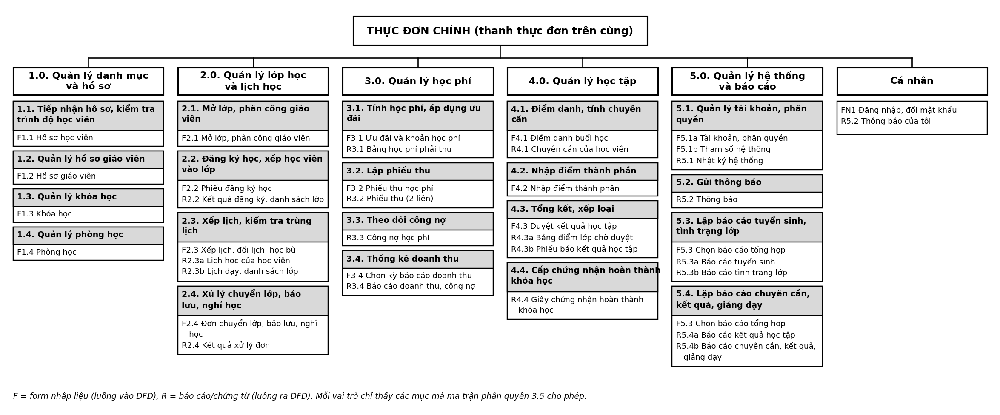
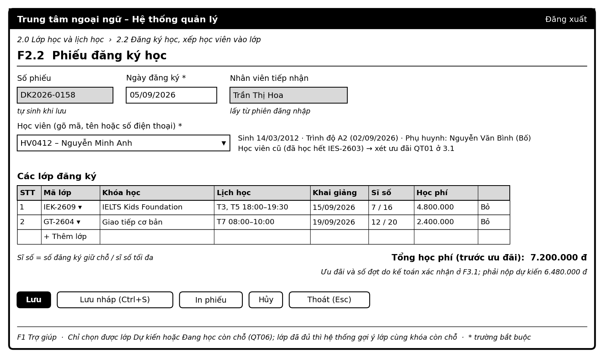
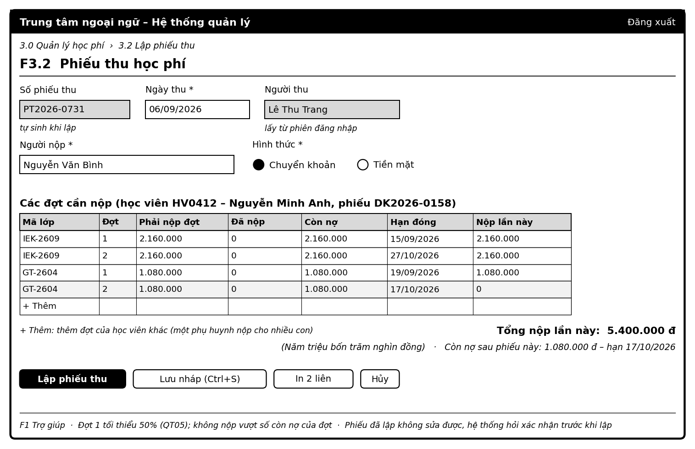
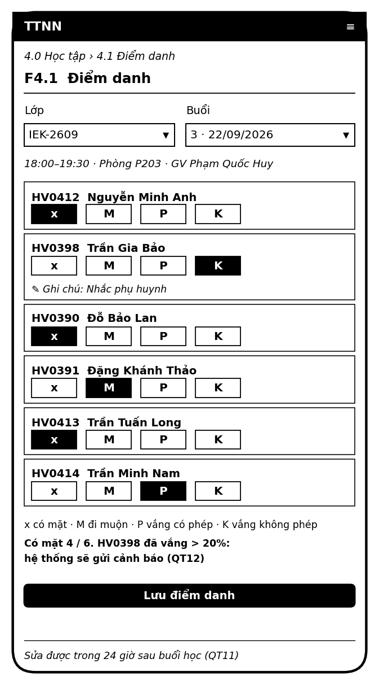
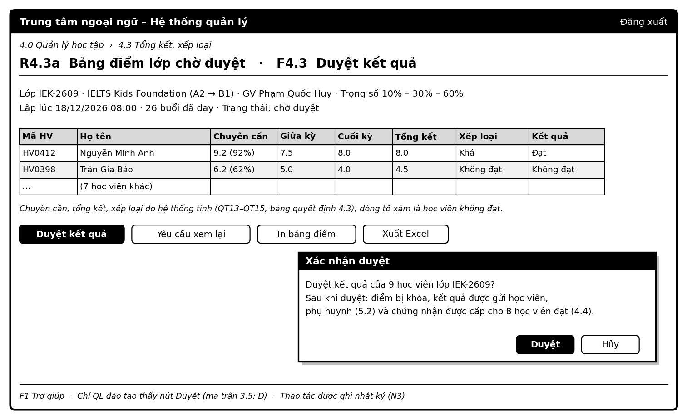

# 3.6 Thiết kế giao diện người – máy – Hệ thống quản lý trung tâm ngoại ngữ

Thuộc giai đoạn Thiết kế hệ thống (KE_HOACH.md, mục 3.6), làm theo bài giảng mục 5.6. Điểm chính của bài giảng: *"mỗi form nhập liệu liên kết với một bộ dữ liệu trên các dòng dữ liệu đi vào một xử lý trong DFD, mỗi report tương ứng với một bộ dữ liệu trên các dòng dữ liệu đi ra"*, và dữ liệu trên form, report *"phải chứa các thành tố dữ liệu lưu trong các datastore hoặc được tính toán từ chúng"*. Vì vậy tài liệu đầu vào của bước này là DFD (`so_do/src/dfd.py`), từ điển dữ liệu (`phan_tich/04_dac_ta.md`), CSDL (3.4) và module, phân quyền (3.5).

Các bảng ở mục 3, 4 và 6 là nguồn dữ liệu cho `so_do/src/giao_dien.py`. Script này kiểm tra (mục 7), rồi vẽ sơ đồ thực đơn và các bản phác thảo màn hình (mục 5).

---

## 1. Yêu cầu và chức năng của giao diện

**5 yêu cầu của giao diện (bài giảng):**

| Yêu cầu | Cách đáp ứng |
|---|---|
| Dễ sử dụng | Kiểu **điền mẫu**: màn hình giống chứng từ giấy đang dùng (phiếu đăng ký, phiếu thu, sổ điểm danh), theo đúng thứ tự trường trên giấy. Danh mục chọn từ danh sách, không gõ lại mã |
| Tốc độ thao tác đủ nhanh | Gợi ý khi gõ mã hoặc tên học viên; tự điền các trường đã biết (học phí, lịch, giáo viên của lớp); điểm danh một chạm cho mỗi học viên |
| Chính xác, phân biệt rõ phạm vi chức năng | Thực đơn phân cấp có cùng mã với BFD/DFD/module. Mỗi màn hình ghi mã và tên chức năng ở tiêu đề. Chỉ hiện những mục mà vai trò được phép (ma trận 3.5) |
| Dễ kiểm soát | Người dùng luôn biết mình đang ở đâu (đường dẫn trên đầu màn hình). Có nút Lưu nháp, Hủy, Thoát. Thao tác không quay lại được (lập phiếu thu, duyệt kết quả) phải xác nhận trước khi ghi |
| Dễ phát triển | Mỗi form, report gắn với một module. Thêm chức năng mới thì thêm module và mục thực đơn, không phải sửa màn hình cũ |

**6 chức năng của giao diện (bài giảng) → thành phần đảm nhiệm:**

| Chức năng | Ở hệ thống này |
|---|---|
| Giữ an ninh | N1 đăng nhập; N2 kiểm tra vai trò và phạm vi dữ liệu trước mỗi màn hình |
| Lọc dữ liệu không cần thiết | Form chỉ có các trường của luồng vào tương ứng. Report chỉ hiện dữ liệu trong phạm vi của người xem (phụ huynh chỉ thấy con mình) |
| Mã hóa, giải mã thông điệp | Mật khẩu được băm trước khi lưu. Mã trạng thái (x/M/P/K, Đã đăng ký…) hiện kèm chú giải đầy đủ |
| Phát hiện và sửa lỗi | Kiểm tra ngay khi nhập (định dạng, miền giá trị), kiểm tra quy tắc QT khi lưu; N7 đổi lỗi thành câu báo lỗi kèm gợi ý (mục 6) |
| Lưu trữ tạm thời | N6 lưu nháp phiếu đăng ký, phiếu thu trên trình duyệt |
| Chuyển đổi khuôn mẫu | Ngày dd/MM/yyyy, tiền có dấu chấm phân cách (6.480.000), số tiền viết bằng chữ trên phiếu thu; xuất Excel, PDF (N5) |

---

## 2. Người sử dụng và cách tương tác

Bài giảng đặt 5 câu hỏi cho mỗi form, report: *ai dùng, để làm gì, khi nào, gửi đi đâu, bao nhiêu người*. Bảng dưới trả lời theo từng nhóm người dùng; chi tiết của từng form, report ở mục 3 và 4.

| Nhóm người dùng | Số người (BT1) | Dùng để làm gì, khi nào | Thiết bị | Kiểu tương tác chính |
|---|---|---|---|---|
| NV tuyển sinh / CSHV | 3–4 | Tiếp nhận hồ sơ, đăng ký, xử lý đơn, trong giờ làm việc, cao điểm trước khai giảng | Máy tính ở quầy | Trực tuyến, điền mẫu |
| NV kế toán | 2 | Lập phiếu thu khi học viên nộp tiền; xem công nợ hằng ngày; báo cáo cuối tháng | Máy tính, máy in phiếu | Trực tuyến; báo cáo theo kỳ |
| QL đào tạo | 1–2 | Danh mục, mở lớp, xếp lịch đầu kỳ; duyệt kết quả cuối khóa | Máy tính | Trực tuyến |
| Giáo viên | 30 | Điểm danh đầu mỗi buổi; nhập điểm giữa, cuối khóa | **Điện thoại** | Trực tuyến, màn hình hẹp |
| Học viên, phụ huynh | ~500 HV và phụ huynh | Xem lịch, học phí, chuyên cần, kết quả bất kỳ lúc nào; nhận thông báo | Điện thoại | Chỉ xem |
| Giám đốc | 1 | Xem báo cáo cuối tháng, cuối quý hoặc khi cần | Máy tính | Báo cáo theo kỳ (MIS) |
| Quản trị viên | 1 | Tạo tài khoản đầu kỳ, cấu hình, xem nhật ký | Máy tính | Trực tuyến |

**Xử lý trực tuyến và theo lô** (bài giảng): mọi form đều xử lý **trực tuyến**, ghi ngay khi bấm Lưu. Có 3 xử lý chạy **theo lô** vào đầu mỗi ngày:
- sinh thông báo (5.2);
- tính công nợ, đánh dấu quá hạn (3.3);
- chuyển các đăng ký quá hạn bảo lưu sang Nghỉ học (2.4).

Mọi báo cáo theo kỳ đều in **thời điểm lập** ở đầu trang, đúng lưu ý của bài giảng: thông tin xử lý theo lô có thể đã cũ so với lúc đọc.

---

## 3. Form nhập liệu (luồng vào DFD)

Mã form: `F` + mã module. Cột *Luồng DFD* ghi theo dạng `tác nhân: tên luồng`, đúng tên trên DFD mức 1. Cột *Trường nhập* ghi theo dạng `Bảng: trường, …`, đúng tên của CSDL 3.4. Các trường tự sinh (mã tự tăng, ngày lập, người lập lấy từ phiên đăng nhập) không phải nhập. Dòng `Tham số:` là các điều kiện lọc, không ghi vào CSDL.

| Mã | Tên form | Module | Luồng DFD | Người dùng | Kiểu giao diện | Trường nhập |
|---|---|---|---|---|---|---|
| F1.1 | Hồ sơ học viên | 1.1 | TS: Hồ sơ học viên, kết quả kiểm tra đầu vào | TS | Điền mẫu, có tìm kiếm | HocVien: HoTen, NgaySinh, GioiTinh, DienThoai, Email, DiaChi, TrinhDoDauVao, NgayKiemTra, TrangThai; PhuHuynh: HoTen, DienThoai, Email; HocVienPhuHuynh: QuanHe |
| F1.2 | Hồ sơ giáo viên | 1.2 | DT: Thông tin giáo viên | DT | Điền mẫu | GiaoVien: HoTen, NgaySinh, DienThoai, Email, NgonNguDay, ChuyenMon, BangCap, TinhTrang |
| F1.3 | Khóa học | 1.3 | DT: Thông tin khóa học | DT | Điền mẫu | KhoaHoc: MaKH, TenKH, NgonNgu, TrinhDoDauVao, TrinhDoDauRa, SoBuoi, ThoiLuongBuoi, HocPhi, TSChuyenCan, TSGiuaKy, TSCuoiKy, MoTa, TrangThai |
| F1.4 | Phòng học | 1.4 | DT: Thông tin phòng học | DT | Điền mẫu | PhongHoc: MaPhong, TenPhong, SucChua, ThietBi, TinhTrang |
| F2.1 | Mở lớp, phân công giáo viên | 2.1 | DT: Kế hoạch mở lớp, phân công giáo viên | DT | Điền mẫu, bảng con lịch tuần | LopHoc: MaLop, MaKH, MaGV, NgayKhaiGiang, SiSoToiDa, TrangThai; LichTuan: Thu, GioBatDau, MaPhong |
| F2.2 | Phiếu đăng ký học | 2.2 | TS: Phiếu đăng ký; HV: Yêu cầu đăng ký | TS | Điền mẫu theo phiếu giấy, bảng con các lớp | PhieuDangKy: NgayDK; DangKy: MaHV, MaLop |
| F2.3 | Xếp lịch, đổi lịch, học bù | 2.3 | DT: Yêu cầu đổi lịch, học bù, dạy thay | DT | Điền mẫu, kèm lịch dạng lưới | BuoiHoc: Ngay, GioBatDau, GioKetThuc, MaPhong, MaGV, Loai, NoiDung, TrangThai |
| F2.4 | Đơn chuyển lớp, bảo lưu, nghỉ học | 2.4 | TS: Đơn chuyển lớp, bảo lưu; HV: Yêu cầu chuyển lớp, bảo lưu | TS | Điền mẫu, có hộp đối thoại báo kết quả xét | DangKy: MaHV, MaLop, TrangThai, LyDo, MaLopGoc |
| F3.1 | Ưu đãi và khoản học phí | 3.1 | KT: Ưu đãi | KT | Điền mẫu (danh mục ưu đãi); xác nhận khoản học phí | UuDai: MaUD, TenUD, LoaiUD, TyLeGiam, NgayBatDau, NgayKetThuc, DieuKien; HocPhi: SoDot; ApDungUuDai: MaUD |
| F3.2 | Phiếu thu học phí | 3.2 | KT: Thông tin thu tiền; HV: Tiền học phí | KT | Điền mẫu theo phiếu giấy, bảng con các đợt | PhieuThu: NgayThu, NguoiNop, HinhThuc; ChiTietPhieuThu: MaHV, MaLop, Dot, SoTien |
| F3.4 | Chọn kỳ báo cáo doanh thu | 3.4 | GD: Yêu cầu báo cáo doanh thu | GD | Đối thoại | Tham số: Từ ngày, Đến ngày, Khóa học |
| F4.1 | Điểm danh buổi học | 4.1 | GV: Phiếu điểm danh buổi học | GV | Điền mẫu trên điện thoại, một chạm mỗi học viên | DiemDanh: SoBuoi, MaHV, TrangThai, GhiChu |
| F4.2 | Nhập điểm thành phần | 4.2 | GV: Điểm số, nhận xét | GV | Điền mẫu dạng bảng | Diem: MaHV, LoaiDiem, Diem, NhanXet |
| F4.3 | Duyệt kết quả học tập | 4.3 | DT: Phê duyệt kết quả học tập | DT | Đối thoại xác nhận trên bảng điểm chờ duyệt (R4.3a) | KetQua: MaNVDuyet, NgayDuyet; Tham số: Duyệt hoặc Yêu cầu xem lại, Ghi chú |
| F5.1a | Tài khoản, phân quyền | 5.1 | QT: Tài khoản, phân quyền, cấu hình | QT | Điền mẫu | TaiKhoan: TenDangNhap, VaiTro, MaNV, MaGV, MaHV, MaPH, TrangThai; NhanVien: HoTen, BoPhan, ChucVu, DienThoai, Email, TrangThai |
| F5.1b | Tham số hệ thống | 5.1 | QT: Tài khoản, phân quyền, cấu hình | QT | Điền mẫu dạng bảng | ThamSo: GiaTri |
| F5.3 | Chọn báo cáo tổng hợp | 5.3, 5.4 | GD: Yêu cầu báo cáo tổng hợp | GD | Đối thoại | Tham số: Loại báo cáo, Từ ngày, Đến ngày, Khóa học, Lớp, Giáo viên |
| FN1 | Đăng nhập, đổi mật khẩu | N1 | – | HV, PH, GV, TS, KT, DT, GD, QT | Đối thoại | TaiKhoan: TenDangNhap, MatKhauBam |

Ghi chú:
- **F2.2 và F2.4:** yêu cầu của học viên đến quầy bằng lời hoặc bằng giấy. Nhân viên tuyển sinh nhập thay, nên một form phục vụ cả 2 luồng vào (của HV và của TS).
- **F3.2:** tương tự, tiền do học viên nộp, kế toán nhập.
- **F3.1:** sau khi đăng ký, kế toán xác nhận học viên chọn **đóng một lần hay hai đợt** (`HocPhi.SoDot`, điều kiện C3 của bảng quyết định 3.1), và có thuộc **nhóm đăng ký** hay không (ưu đãi C2). Ưu đãi học viên cũ (C1) do hệ thống tự xét. Phần này đã được bổ sung vào cấu trúc luồng "Ưu đãi" trong từ điển dữ liệu (`phan_tich/04_dac_ta.md` mục 4.2), vì đây là lựa chọn của học viên mà trước đó chưa luồng nào mang.

---

## 4. Báo cáo, chứng từ đầu ra (luồng ra DFD)

Mã báo cáo: `R` + mã module. Theo bài giảng, có 3 loại tài liệu:
- **nội bộ:** dùng trong trung tâm;
- **bên ngoài:** gửi học viên, phụ huynh; dùng thống nhất mẫu có tên và logo trung tâm;
- **xoay vòng:** gửi ra ngoài rồi quay về làm dữ liệu vào.

| Mã | Tên báo cáo / chứng từ | Module | Luồng DFD | Người nhận | Loại tài liệu | Xử lý | Nguồn dữ liệu |
|---|---|---|---|---|---|---|---|
| R2.2 | Kết quả đăng ký, danh sách lớp | 2.2 | TS: Kết quả đăng ký, danh sách lớp | TS | Nội bộ | Trực tuyến | DangKy, LopHoc, HocVien; v_SiSoLop, v_HocPhiDangKy |
| R2.3a | Lịch học của học viên | 2.3 | HV: Lịch học | HV, PH | Bên ngoài | Trực tuyến | BuoiHoc, LopHoc, DangKy |
| R2.3b | Lịch dạy, danh sách lớp | 2.3 | GV: Lịch dạy, danh sách lớp | GV | Nội bộ | Trực tuyến | BuoiHoc, LopHoc, DangKy, HocVien |
| R2.4 | Kết quả xử lý đơn | 2.4 | TS: Kết quả xử lý đăng ký | TS | Nội bộ | Trực tuyến | DangKy, LopHoc |
| R3.1 | Bảng học phí phải thu | 3.1 | KT: Học phí phải thu | KT | Nội bộ | Trực tuyến | HocPhi, DotHocPhi, ApDungUuDai, UuDai, DangKy |
| R3.2 | Phiếu thu (2 liên) | 3.2 | HV: Phiếu thu; KT: Phiếu thu | HV, PH, KT | **Xoay vòng**: liên 2 giao người nộp, mang lại khi nộp đợt sau để đối chiếu số còn nợ | Trực tuyến | PhieuThu, ChiTietPhieuThu, DotHocPhi, HocPhi, HocVien, LopHoc, KhoaHoc |
| R3.3 | Công nợ học phí | 3.3 | KT: Công nợ | KT | Nội bộ | Theo lô, đầu ngày | fn_CongNo |
| R3.4 | Báo cáo doanh thu, công nợ | 3.4 | GD: Báo cáo doanh thu, công nợ | GD | Nội bộ | Theo kỳ | v_DoanhThu, fn_CongNo |
| R4.1 | Chuyên cần của học viên | 4.1 | HV: Chuyên cần | HV, PH | Bên ngoài | Trực tuyến | v_ChuyenCan, DiemDanh, BuoiHoc |
| R4.3a | Bảng điểm lớp chờ duyệt | 4.3 | DT: Bảng điểm chờ duyệt | DT | Nội bộ | Trực tuyến | v_KetQuaTinh, Diem, KhoaHoc, HocVien |
| R4.3b | Phiếu báo kết quả học tập | 4.3 | HV: Kết quả học tập | HV, PH | Bên ngoài | Trực tuyến | KetQua, Diem, HocVien, LopHoc |
| R4.4 | Giấy chứng nhận hoàn thành khóa học | 4.4 | HV: Chứng nhận | HV, PH | Bên ngoài | Trực tuyến (in) | ChungNhan, KetQua, HocVien, LopHoc, KhoaHoc, BuoiHoc |
| R5.1 | Nhật ký hệ thống | 5.1 | QT: Nhật ký hệ thống | QT | Nội bộ | Trực tuyến | NhatKy, TaiKhoan |
| R5.2 | Thông báo | 5.2 | HV: Thông báo | HV, PH | Bên ngoài | Theo lô, đầu ngày | ThongBao |
| R5.3a | Báo cáo tuyển sinh | 5.3 | GD: Báo cáo tuyển sinh | GD | Nội bộ | Theo kỳ | v_TuyenSinh, KhoaHoc |
| R5.3b | Báo cáo tình trạng lớp | 5.3 | DT: Báo cáo lớp học | DT | Nội bộ | Theo kỳ | v_SiSoLop, LopHoc |
| R5.4a | Báo cáo kết quả học tập | 5.4 | GD: Báo cáo kết quả học tập | GD | Nội bộ | Theo kỳ | KetQua, LopHoc, KhoaHoc |
| R5.4b | Báo cáo chuyên cần, kết quả, giảng dạy | 5.4 | DT: Báo cáo chuyên cần, kết quả, giảng dạy | DT | Nội bộ | Theo kỳ | v_ChuyenCan, v_GiangDay, KetQua, GiaoVien |

---

## 5. Thực đơn và màn hình

### 5.1 Thực đơn phân cấp

Thiết kế theo kiểu **thực đơn phân cấp** (bài giảng 5.6.2.2), gồm 3 cấp:
- **Cấp 1:** 5 phân hệ, cộng mục "Cá nhân" (đăng nhập, đổi mật khẩu, thông báo của tôi).
- **Cấp 2:** 20 module, cùng mã với BFD.
- **Cấp 3:** các form, report của module.

Mỗi vai trò chỉ thấy các mục mà ma trận 3.5 cho phép. Ví dụ, giáo viên chỉ thấy *2.3 Lịch dạy*, *4.1 Điểm danh*, *4.2 Nhập điểm*, *4.3 Kết quả lớp mình*. Mỗi thực đơn không quá 4 mục, nên không có thực đơn nào quá dài (bài giảng: "không nên thiết kế quá nhiều chức năng trên một thực đơn").

### 5.2 Quy ước chung cho mọi màn hình

| Quy ước | Nội dung |
|---|---|
| Bố cục | Đường dẫn (vd *2.0 Lớp học › 2.2 Đăng ký học*) ở trên cùng; tiêu đề có mã form; vùng nhập theo thứ tự của chứng từ giấy; nút lệnh ở dưới cùng; dòng trợ giúp ở đáy màn hình |
| Màu sắc | Đen, trắng, xám; chỉ dùng **một màu nhấn** cho lỗi và cảnh báo (bài giảng: không dùng quá nhiều màu gây rối mắt) |
| Nút lệnh | Cùng tên, cùng vị trí trên mọi form: **Lưu** (Ctrl+S), **Lưu nháp** (2.2, 3.2), **Hủy**, **Thoát** (Esc), **In** (Ctrl+P), **Trợ giúp** (F1) |
| Trường bắt buộc | Có dấu \*. Trường bắt buộc lấy theo cột "Bắt buộc" của 3.1 (NOT NULL trong 3.4) |
| Danh sách chọn | Mọi miền giá trị `[a \| b]` của 3.1 (trạng thái, giới tính, loại ưu đãi…) hiện thành danh sách chọn, không cho gõ tự do |
| Xác nhận | Hỏi lại trước khi ghi những thao tác không sửa được: lập phiếu thu, duyệt kết quả, chuyển trạng thái Nghỉ học |
| Màn hình hẹp | Form F4.1, F4.2 và các report của HV, PH xếp thành một cột trên điện thoại |

### 5.3 Phác thảo màn hình

Bản phác thảo (form layout, theo bài giảng) của 4 màn hình quan trọng nhất, điền đúng dữ liệu của chứng từ mẫu.

---

## 6. Trợ giúp và thông báo lỗi

**5 yêu cầu của trợ giúp (bài giảng) → cách đáp ứng:**

| Yêu cầu | Cách đáp ứng |
|---|---|
| Sẵn sàng | Phím F1 và nút "?" trên mọi màn hình; chú thích hiện khi trỏ chuột vào từng trường |
| Nhất quán | Mỗi dữ liệu chỉ có **một tên** trên mọi form, report: lấy đúng tên thuộc tính của 3.1. Ví dụ "Học phí gốc" và "Học phí" của khóa là hai tên khác nhau (3.3 mục 7.1) |
| Chính xác, đầy đủ | Trợ giúp của mỗi màn hình ghi rõ quy tắc QT đang áp dụng. Ví dụ F3.2 ghi "Đợt 1 tối thiểu 50% (QT05)" |
| Linh hoạt | Mỗi người tự chọn số dòng trên một trang và cột hiển thị trong báo cáo; lưu nháp để làm tiếp sau |
| Tin cậy | Mọi lỗi đều được phát hiện và có **gợi ý sửa**, theo bảng dưới đây |

**Thông báo lỗi** (module N7). Mỗi ràng buộc của CSDL (3.4) và mỗi quy tắc QT ở tầng ứng dụng có một câu báo lỗi ngắn, chỉ nói về một vấn đề, có gợi ý sửa (bài giảng 5.6.2.5: "thông báo ngắn, có ý nghĩa, mỗi thời điểm chỉ đề cập một khái niệm"):

| Nguồn lỗi | Màn hình | Thông báo | Gợi ý sửa |
|---|---|---|---|
| CK_HocVien_DienThoai | F1.1 | Số điện thoại phải gồm đúng 10 chữ số. | Bỏ khoảng trắng, dấu chấm; vd 0912345678 |
| CK_HocVien_KiemTra | F1.1 | Đã nhập trình độ nhưng thiếu ngày kiểm tra (hoặc ngược lại). | Nhập đủ cả hai, hoặc để trống cả hai |
| UQ_GiaoVien_Email | F1.2 | Email này đã thuộc một giáo viên khác. | Kiểm tra trùng hồ sơ trước khi thêm mới |
| CK_KhoaHoc_TrongSo | F1.3 | Tổng ba trọng số phải bằng 100%. | Vd 10 – 30 – 60 |
| CK_LopHoc_SiSoToiDa | F2.1 | Sĩ số tối đa phải lớn hơn 0. | Theo quy định, không quá 20 (QT06) |
| PK_DangKy | F2.2 | Học viên đã có đăng ký ở lớp này. | Chọn lớp khác cùng khóa còn chỗ |
| CK_BuoiHoc_Gio | F2.3 | Giờ kết thúc phải sau giờ bắt đầu. | Kiểm tra lại khung giờ |
| CK_DangKy_HanBaoLuu | F2.4 | Đăng ký bảo lưu phải có hạn bảo lưu. | Hệ thống tự điền ngày bảo lưu + 6 tháng; không xóa ô này |
| CK_UuDai_Ngay | F3.1 | Ngày kết thúc ưu đãi phải sau ngày bắt đầu. | Kiểm tra lại thời gian hiệu lực |
| CK_ChiTietPhieuThu_SoTien | F3.2 | Số tiền nộp phải lớn hơn 0. | Bỏ dòng đợt không nộp |
| CK_Diem_Diem | F4.2 | Điểm phải từ 0 đến 10. | Dùng dấu chấm cho phần lẻ, vd 7.5 |
| FK_DiemDanh_BuoiHoc | F4.1 | Buổi học này không thuộc lớp đang chọn. | Chọn lại buổi trong lịch của lớp |
| CK_KetQua_Dat | F4.3 | Kết quả "Đạt" không đi với xếp loại "Không đạt". | Chạy lại tổng kết; không sửa tay kết quả |
| CK_TaiKhoan_ChuSoHuu | F5.1a | Vai trò không khớp với chủ tài khoản. | Vai trò Giáo viên chọn mã giáo viên; Học viên chọn mã học viên… |
| FK_ThongBao_GiamHo | R5.2 | Người nhận không phải phụ huynh của học viên này. | Kiểm tra quan hệ giám hộ ở F1.1 |
| QT05 | F3.2 | Đợt 1 phải nộp tối thiểu 50% số phải nộp. | Nộp thêm, hoặc chọn đóng hai đợt |
| QT05 | F3.2 | Số tiền vượt số còn nợ của đợt. | Kiểm tra lại đợt và số còn nợ |
| QT06 | F2.2 | Lớp đã đủ sĩ số. | Hệ thống gợi ý lớp cùng khóa còn chỗ |
| QT07 | F2.3 | Trùng lịch với lớp khác (cùng giáo viên hoặc cùng phòng). | Đổi giờ, đổi phòng hoặc đổi giáo viên |
| QT08 | F2.4 | Đã quá 3 buổi đầu, không chuyển lớp được. | Xét bảo lưu hoặc nghỉ học |
| QT09 | F2.4 | Chưa đóng đủ học phí, không bảo lưu được. | Đóng đủ trước khi bảo lưu |
| QT11 | F4.1 | Đã quá 24 giờ sau buổi học, không sửa điểm danh được. | Liên hệ QL đào tạo |

---

## 7. Kiểm tra (chạy tự động trong `so_do/src/giao_dien.py`)

Kết quả chạy `python so_do/src/giao_dien.py`: **đạt**.

| # | Nội dung kiểm tra | Kết quả |
|---|---|---|
| 1 | Mỗi luồng giữa tác nhân và hệ thống trên DFD mức 1 đều có form (luồng vào) hoặc báo cáo (luồng ra). Ngược lại, mỗi form, báo cáo (trừ chức năng nền) đều trỏ về một luồng có thật, nên không có màn hình "mồ côi" | Đạt: 39/39 luồng |
| 2 | Trường nhập trên form có trong CSDL (3.1/3.4) và thuộc bảng mà module được ghi (3.5 mục 4). Người dùng của form có quyền nhập (T/S/D) ở module đó | Đạt: 18 form, 106 trường |
| 3 | Nguồn của báo cáo nằm trong các bảng, view mà module đọc được. Người nhận có quyền xem | Đạt: 18 báo cáo |
| 4 | Cả 20 module chức năng đều có ít nhất một màn hình, nên thực đơn không có mục rỗng | Đạt |
| 5 | Mỗi thông báo lỗi trỏ về ràng buộc có trong `csdl/schema.sql` hoặc quy tắc QT có trong 2.1, và về màn hình có thật | Đạt: 22 thông báo |

Script đã được thử với 6 lỗi cố ý: bỏ báo cáo chuyên cần (luồng ra không có báo cáo); trường không có trong CSDL; cho kế toán nhập điểm; cho F2.2 ghi bảng của module khác; ràng buộc không có thật; báo cáo công nợ đọc bảng kết quả học tập. Cả 6 đều bị báo lỗi.

---

## 8. Đầu ra cho các bước sau

| Bước | Dùng gì từ tài liệu này |
|---|---|
| Báo cáo thiết kế (GĐ3) | Toàn bộ tài liệu này là chương Thiết kế giao diện |
| GĐ4 Demo | Bản demo làm các form F1.1, F2.2, F3.2, F4.1, F4.2, FN1 và các báo cáo R3.2, R3.4, R5.3b. Các phác thảo ở mục 5.3 là bản mẫu (prototype) để người dùng góp ý trước khi viết chương trình (2.1, phương pháp làm mẫu) |
| GĐ4 Kiểm thử chấp nhận | Nhập lại 5 chứng từ mẫu qua F1.1, F2.2, F3.2, F4.1, F4.2; R3.2, R4.3b, R4.4 in ra phải trùng chứng từ; mỗi dòng của bảng thông báo lỗi là một ca kiểm thử |
